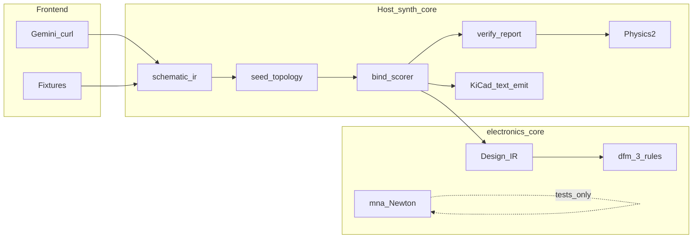

# Architecture Audit — Phase 0

**Date:** 2026-09-21  
**Rule:** Describe what the code *does*, not what filenames suggest.

---

## 1. Intended architecture

```
Natural language
  → NLP / LLM semantic frontend
  → Engineering Specification / DSL
  → Deterministic Design Compiler
  → Topology / Composition IR
  → Parameter Synthesis
  → Real Part Binding / DB
  → DFM / Constraints
  → Physical IR
  → Physics Instruction Set
  → Physics Runtime
  → MNA / DAE Analysis Engine
  → Verification
  → KiCad / PCB / BOM / Reports
```

Probabilistic boundary must stop at the semantic frontend.

---

## 2. Current architecture (actual)

```
CLI / browser
  ├─ generate --prompt → Gemini|fixtures → schematic-ir.v1 JSON
  ├─ generate --spec → SpecV1 → fixture design path
  ├─ generate --compose-gate4 → block expand → schematic-ir
  └─ generate <design.json>
        ↓
  validate schematic-ir
        ↓
  SQLite work DB (seed Parts + Topology*)
        ↓
  bind_score_passive → CompiledSchematic
        ↓
  verify_bound_schematic
        ├─ LED / RC / RL analytical heuristics
        ├─ transistor/IC structural auto-pass
        └─ else Physics2 linear DC (resistors-focused)
        ↓
  mfg_dfm → vendor_bridge → vendor_next dfm (3 rules)
        ↓
  C text emit: .kicad_sch, .net, bom.csv, snapshots
```

**Parallel unused on generate path:** vendor_next MNA Newton; `part_provider` / `e_series`; `CompilerPhysDesign` → Physics2 lowering API; SQLite `FabRules`.



---

## 3. Missing layers vs intended

| Intended layer | Current state |
|----------------|---------------|
| Engineering DSL | SpecV1 + schematic-ir JSON only; no full eng language |
| Topology / Composition IR | schematic-ir + compose blocks; not a typed graph IR |
| Parameter synthesis | Heuristic bind + E-series in catalogue (mostly unused) |
| Physical IR | Implicit in `CompiledSchematic` / Physics2 primitives |
| Physics ISA | Exists (`physics2_isa.h`); param/state pools weakly used |
| Physics Runtime | Physics2 interpreter |
| MNA / DAE | Dual engines; DAE incomplete (BE C/L only in Physics2) |
| PCB backend | **NOT PRESENT** (schematic emit only) |
| Async worker | **NOT PRESENT** (sync HTTP → subprocess) |

---

## 4. Semantic leaks

| Leak | Evidence | Risk |
|------|----------|------|
| LLM topology + MPNs enter DB | `gemini_schematic.c` SYSTEM_RULES; `seed_topology.c` inserts `parts[]` | Deterministic binder trusts LLM catalogue rows |
| Bind hints from IR | `compiler.c` `load_bind_hints` | LLM shapes selection window |
| KiCad emit inside compiler | `compiler_write_kicad_sch` | T mixed into Q |
| Manufacturer data on compile IR | `CompiledComponent` embeds full `DBPart` | Physics path carries MPN |
| Verify structural auto-pass | `verify_report.c` transistor/IC | False confidence |
| Bridge invents ratings | `vendor_bridge.c` 50 V / 5 V defaults | Fake physics for DFM |
| Three DFM meanings | `dfm_compose` vs `mfg_dfm`/vendor vs `FabRules` | Naming/ownership confusion |
| UI drift | `public/` vs `web/static/` | Local vs Vercel divergence |
| compose → cli path helper | fixture root via cli | Layer inversion |

---

## 5. Redundant / parallel abstractions

| Concept | Host | Vendor | Notes |
|---------|------|--------|-------|
| Circuit solve | Physics2 | `mna.c` | Both linked; generate uses Physics2 |
| Part selection | `bind_scorer` + SQLite | `part_provider` | Vendor unused in generate |
| E-series | `catalogue.c` generators | `e_series.c` | Both largely unused at runtime |
| Design IR | `CompiledSchematic` | `Design` | Bridged only for DFM |
| DFM profile | `MfgDfmProfile` + fixtures | `DfmProfile` + `FabRule` | Triplicated constants |

---

## 6. Dependency graph (libraries)

```
main → synth_core → electronics_core
                 → sqlite3, cJSON
golden_runner → synth_core
vendor_*_test → electronics_core
```

**No hard include cycles.** Soft smells: compose→cli; vendor_bridge→compiler.h→physics2 headers unused by bridge numerics.

---

## 7. Ownership model

| Concern | Owner today | Should own |
|---------|-------------|------------|
| NLP → IR | `spec/gemini_schematic`, offline fixtures | NLP frontend only |
| Spec / DSL | SpecV1 + schematic-ir schemas | Future eng language |
| Topology seed | `seed_topology` + SQLite | Compiler / design IR |
| Binding | `bind_scorer` | Part binder + DB (no LLM MPNs) |
| Physics stamps | Physics2 interpreter | Physics ISA runtime |
| Nonlinear Newton | vendor `mna_solve` (tests) | Global nonlinear solver |
| Mfg DFM | vendor `dfm` via bridge | Constraint engine |
| Block port DFM | `dfm_compose` | Composition layer (rename clear) |
| KiCad syntax | `compiler_write_kicad_sch`, `emit_*` | Emit backend only |
| Web lifetime | sync `subprocess.run` | Job worker |

---

## 8. Runtime boundaries

- **Physics2:** linear stamps + BE dynamics; opaque accumulator; no Newton.
- **vendor MNA:** DC R+V+diode Newton; dense matrix visible to stamps.
- **Generate must not require Gemini** — offline fixtures and `--spec` / design JSON work without API keys. **Preserve this.**

---

## 9. LLM boundary

**GOOD:** Gemini writes validated schematic-ir JSON only; no MNA/Newton/DFM/KiCad calls.

**QUESTIONABLE:** Prompt embeds recipes and DEMO MPNs; retry narrows part types.

**DANGEROUS (data trust):** Valid IR seeds Parts + topology that drive bind/verify/DFM/emit. Hallucinated MPNs can win binder.

Desired:

```
Gemini → Structured Spec (no MPN catalogue) → deterministic compiler
```

---

## 10. DB boundary

`Parts` mixes: MPN, polymorphic `value`, ratings, ESR, tolerance.  
Physics parameters vs procurement vs DFM must be separated long-term.  
`0` / NULL both mean “don’t enforce” after read path — unsafe as rating.

---

## 11. DFM boundary

| Layer | File | Role |
|-------|------|------|
| Block ports | `dfm_compose.*` | Composition feasibility |
| Manufacturing | `mfg_dfm` → `vendor_next/dfm` | Only floating pin, missing footprint, height |
| SQLite FabRules | `db.c` | Orphaned |

Most profile fields (trace, clearance, via, …) are **decorative** today.

---

## 12. KiCad boundary

Browser → Python server → `synth generate` → C fprintf S-expression `.kicad_sch`.  
**No** KiCad Python API in browser. Optional `kicad-cli sch erc` offline.  
Safe display path (future): worker produces SVG/PNG via kicad-cli; browser shows artifacts.

---

## 13. Physics2 boundary

ISA fields: opcode, primitive_id, terminals, branch, parameter_id, state_id, flags.  
Manufacturer identity absent from opcodes (good).  
Stamps still pull payloads from primitives, not param pool (incomplete separation).  
Diode/BJT/MOS/logic opcodes exist but are non-executable.

---

## 14. Generation timeout / async proposal (design only)

Current:

```
POST /api/chat → subprocess synth (50s Vercel / 300s local) → response
```

Sources: `web/server.py` timeout; `vercel.json` maxDuration 60; Gemini curl 45s × ≤6 attempts.

Proposed (Phase 1+, not implemented):

```
POST /generate → job_id → worker (NLP, compile, DB, DFM, Physics, KiCad) → artifacts
GET /jobs/:id
```

Web request must not be the lifetime of engineering simulation.

---

## 15. Engineering language readiness

**Can express today (JSON):** components, nets, some constraints (ratings), analysis indirectly via verify, mfg profile JSON.

**Must not express (and mostly doesn't):** dense matrix indexes, Newton internals — good.

**Missing:** requirements DSL, typed rails/ports as language, analysis requests as first-class, manufacturing requirements separate from netlist, optimizer hooks.

---

## 16. Module classification (summary)

| Class | Modules |
|-------|---------|
| A CLI | `main.c`, `cli/*` |
| B NLP/LLM | `gemini_schematic.*`, prompt path in `schematic_load.*` |
| C Spec | `spec_load.*`, SpecV1 fixtures, schematic-ir schemas |
| D Eng language | partial: IR schemas, `unit_parse`, SpecV1 |
| E Topology | `seed_topology`, compose expand, Topology* tables |
| F Physical model | vendor diode math; Physics2 stamps |
| G Physics IR | `physics2_types`, symbols, typecheck, print |
| H Physics ISA | `physics2_isa.*` |
| I Runtime | `physics2_interpreter.*` |
| J Numerical assembly | accumulator / stamp_*; vendor assemble |
| K Linear solver | dense GE both stacks |
| L Nonlinear | vendor Newton only |
| M Dynamic | Physics2 BE C/L |
| N AC | none |
| O Device library | `component_model`, `part_lib` |
| P Database | `db.*`, jlcparts_import, catalogue |
| Q Part binding | `bind_scorer`, part_provider (unused) |
| R DFM | dfm_compose, mfg_dfm, vendor dfm |
| S Verification | `verify_report` |
| T KiCad | compiler emit, emit_netlist/bom |
| U PCB | none |
| V Web/API | `web/server.py`, `api/index.py`, static UI |
| W Tests | golden_*, vendor_next/tests |
| X Infra | CMakeLists, build.sh, third_party, ponytail |

Full per-file map: see [`MODULE_MAP.md`](MODULE_MAP.md).
